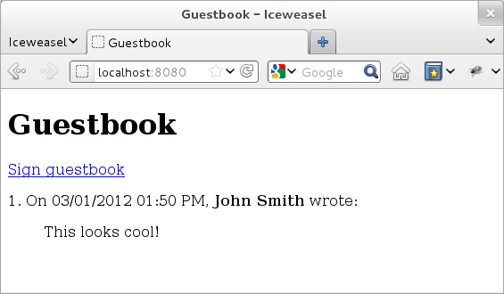

Tutorial
========

This tutorial will teach you the basics of building a :ref:`wheezy.web`
application using your favorite text editor and python. We will use SQLite as
database and python version 2.6+ or 3.2 (mainly for context manager and
built-in JSON support). *AJAX and JSON* section of tutorial require jQuery.

Estimated completion time: 30-60 minutes.

Prerequisites
-------------

Before you start, make sure you've installed the prerequisites listed below.

* Check python version::

    $ python -V
    Python 2.7.2+

* Create virtual environment::

    $ virtualenv env

* Install :ref:`wheezy.web` into virtual environment::

    $ env/bin/easy_install wheezy.web

What You'll Build
-----------------

You will implement a simple guestbook application where users can see a list
of greetings as well as add their own.

List of greetings:

Sign guestbook:

.. image:: static/screenshot2.png

For the purpose of this tutorial we store each of identified software
actor in own file so at the end you will get a project structure with well
defined roles.

Domain Model
------------

Domain model represents key concepts of entities within a scope of the
application. Our primary entity is a greeting that visitor leave in
guestbook, it can be characterized by the following: a time stamp
when it was added (current time), author and a message.

Let model what we figured so far (file ``models.py``)::

    from datetime import datetime
    from wheezy.core.comp import u

    class Greeting(object):

        def __init__(self, id=0, created_on=None, author=u(''), message=u('')):
            self.id = id
            self.created_on = created_on or datetime.now()
            self.author = author
            self.message = message

The function ``u()`` is a compatibility function that always return unicode
version of string regardless of python version. If you are using python 3
you can eliminate it completely since any string is natively unicode in
python 3 (vs byte string in python 2).

Validation Rules
----------------

Two attributes ``author`` and ``message`` are entered by visitor so we need
apply some validation rules:

* ``author`` can be left blank (for anonymous entries) but if it is entered
  it should not exceed 20 characters in length.
* ``message`` is required and let take that anything meaningful can be
  expressed in a text between 5 to 512 characters.

So far so good let define our application domain validation constraints
(file ``validation.py``)::

    from wheezy.validation import Validator
    from wheezy.validation.rules import length
    from wheezy.validation.rules import required

    greeting_validator = Validator({
        'author': [length(max=20)],
        'message': [required, length(min=5, max=512)],
    })

For the complete list of validation rules available please refer to
`wheezy.validation`_ documentation.

Database
--------

For the purpose of this tutorial we have selected SQLite database as
persistence layer so let define SQL schema for our domain (file
``schema.sql``)::

    CREATE TABLE greeting (
        id INTEGER PRIMARY KEY AUTOINCREMENT,
        created_on TIMESTAMP NOT NULL,
        author TEXT,
        message TEXT NOT NULL
    );

Issue the following command from terminal::

    $ cat schema.sql | sqlite3 guestbook.db

This creates SQLite database ``guestbook.db`` with table ``greeting``.

Let try add some data from sqlite3 command prompt::

    $ sqlite3 guestbook.db
    SQLite version 3.7.10 2012-01-16 13:28:40
    Enter ".help" for instructions
    Enter SQL statements terminated with a ";"
    sqlite> INSERT INTO greeting (created_on, author, message)
       ...> VALUES ('2012-03-01 13:50:27', 'John Smith', 'This looks cool!');
    sqlite> SELECT * FROM greeting;
    1|2012-03-01 13:50|John Smith|This looks cool!
    sqlite> .quit

We will use these two basic SQL statements (SELECT and INSERT) in repository.

Configuration
^^^^^^^^^^^^^

Let add configuration file where we can store some settings (file
``config.py``)::

    import sqlite3

    def session():
        return sqlite3.connect('guestbook.db',
            detect_types=sqlite3.PARSE_DECLTYPES)

We have defined function ``session()`` that returns an object valid to
issue some database related operations including query for data,
transaction commit, etc. This object serves *unit of work* purpose and is
suitable to be used with python context manager.

Repository
----------

A Repository mediates between the domain and persistence layers (database,
file, in-memory storage, etc.), it encapsulates operations performed and
provides object-oriented view of the persistence layer.

Accordingly to problem statement, we need two things here: a way to get a
list of greetings and ability to add a greeting.

Since we have database and a way to obtain database object we can add
repository (file ``repository.py``)::

    from models import Greeting

    class Repository(object):

        def __init__(self, db):
            self.db = db

        def list_greetings(self):
            cursor = self.db.execute("""
                    SELECT id, created_on, author, message
                    FROM greeting
                    ORDER BY id DESC
                    LIMIT 10
            """)
            return [Greeting(
                    id=row[0],
                    created_on=row[1],
                    author=row[2],
                    message=row[3]) for row in cursor.fetchall()]

        def add_greeting(self, greeting):
            self.db.execute("""
                    INSERT INTO greeting (created_on, author, message)
                    VALUES (?, ?, ?)
            """, (greeting.created_on, greeting.author, greeting.message))
            return True

Let see how it works from python command prompt::

    $ env/bin/python
    Python 2.7.2+ (default, Dec  1 2011, 01:55:02)
    [GCC 4.6.2] on linux2
    Type "help", "copyright", "credits" or "license" for more information.
    >>> from config import session
    >>> from repository import Repository
    >>> db = session()
    >>> repo = Repository(db)
    >>> greetings = repo.list_greetings()
    >>> greetings[0]
    <models.Greeting object at 0xa023e4c>
    >>> greetings[0].created_on
    datetime.datetime(2012, 3, 1, 13, 50, 27)
    >>> db.close()
    >>> exit()

View
----

Handlers
^^^^^^^^

Views contain handlers that respond to requests sent by browser. We need two
handlers: one for list and the other one to add a greeting.

List handler returns a list of greeting stored (file ``views.py``)::

    from wheezy.web.handlers import BaseHandler
    from config import session
    from models import Greeting
    from repository import Repository
    from validation import greeting_validator

    class ListHandler(BaseHandler):

        def get(self):
            with session() as db:
                repo = Repository(db)
                greetings = repo.list_greetings()
            return self.render_response('list.html',
                    greetings=greetings)

We create a *unit of work* by applying function call to ``session`` and
add it to a scope of python operator ``with`` (which effectively closes
our unit of work when execution leaves this scope). ``session`` is closed
before we pass anything to template render.

Add handler store visitor greeting (file ``views.py``)::

    class AddHandler(BaseHandler):

        def get(self, greeting=None):
            greeting = greeting or Greeting()
            return self.render_response('add.html', greeting=greeting)

        def post(self):
            greeting = Greeting()
            if (not self.try_update_model(greeting)
                    or not self.validate(greeting, greeting_validator)):
                return self.get(greeting)
            with session() as db:
                repo = Repository(db)
                if not repo.add_greeting(greeting):
                    self.error('Sorry, can not add your greeting.')
                    return self.get(greeting)
                db.commit()
            return self.see_other_for('list')

The respond to browser request to add handler is simply render ``add.html``
template with some defaults passed with greeting model. However when
visitor submits add page we try update model ``greeting`` with HTML form
data if it fails for any reason we display user error messages
(those returned by ``try_update_model()``). If update model succeed it
holds data entered by user that we can validate with ``greeting_validator``.
Note ``BaseHandler`` keeps a dictionary of all errors reported in ``errors``
attribute. Again if validation fails we redisplay ``add`` page with any
errors reported.

When input is considered valid per all possible checks we create a unit
of work from session and add it to ``with`` operator scope. Again, operation
in repository may fail so we check if fails we add a general error so
user can see it, otherwise we commit changes to unit of work and redirect
user to list handler.

Configuration
^^^^^^^^^^^^^

:ref:`wheezy.web` is agnostic to template render. However it comes with
support for Mako templates.

Let add Mako template configuration (file ``config.py``)::

    from wheezy.html.ext.mako import widget_preprocessor
    from wheezy.web.templates import MakoTemplate

    options = {
            'render_template': MakoTemplate(
                directories=['templates'],
                filesystem_checks=False,
                preprocessor=[widget_preprocessor]
            )
    }

Above configuration says that templates can be found in ``templates``
directory and we are using ``widget_preprocessor`` from `wheezy.html`_.

Layout
^^^^^^

Since templates usually have many things in common let define layout used
by both pages we are going to create (create directory ``templates`` and
add file ``layout.html``)::

    <html>
        <head>
            <title>Guestbook</title>
            <link href="${path_for('static', path='site.css')}"
                type="text/css" rel="stylesheet" />
        </head>
        <body>
            

                ${self.body()}
            

        </body>
    </html>

Templates
^^^^^^^^^

Define template for list handler (in directory ``templates`` add file
``list.html``)::

    <%inherit file="/layout.html"/>

    <h1>Guestbook</h1>
    <a href="${path_for('add')}">Sign guestbook</a>
    %for g in greetings:
    

        ${g.id}. On ${g.created_on.strftime('%m/%d/%Y %I:%M %p')},
        <b>${g.author or 'anonymous'}</b> wrote:
        <blockquote>${g.message.replace('\n', ' ')}</blockquote>
    

    %endfor

What is interesting here is ``path_for()`` function that can build reverse
path for given route name. So when someone click on ``Sign guestbook``
link browser navigates to url that let add a greeting.

Define template for add handler (in directory ``templates`` add file
``add.html``)::

    <%inherit file="/layout.html"/>

    <h1>Sign Guestbook</h1>
    ${greeting.error()}
    <form action="${path_for('add')}" method='post'>
        

            ${greeting.author.label('Author:')}
            ${greeting.author.textbox()}
            ${greeting.author.error()}
        

        

            ${greeting.message.textarea()}
            ${greeting.message.error()}
        

        

        <input type='submit' value='Leave Message'>
        

    </form>
    <a href="${path_for('list')}">Back</a>

Here you can see syntax provided by `wheezy.html`_ for HTML rendering: label,
textbox, error, etc. Please refer to `wheezy.html`_ documentation.

Style
^^^^^

Let add some style (create directory ``static`` and add file ``site.css``)::

    input[type="text"], textarea {
        border: 1px solid #BBB; border-radius: 3px; }
    input.error, textarea.error {
        border: 1px solid #FF0000; background-color: #FFEEEE; }
    span.error { color: #FF0000; display: block; font-size: 0.95em;
        background: transparent 0px 2px no-repeat; text-indent: 2px; }
    span.error-message {
        display: block; padding: 25px 25px 25px 80px; margin: 0 0 15px 0;
        border: 1px solid #DFDFDF; color: #333333; font-size: 13px;
        line-height: 17px; float: none; font-weight: normal;
        width: auto; -moz-border-radius:5px 5px 5px 5px; }
    span.error-message { border:1px solid #C44509;
        background: no-repeat scroll 2px 50% #fdcea4; }

URLs
----

URLs tell how browser requests maps to handlers that ultimately process them.
Let map the root path to list handler and ``add`` path to add handler
(file ``urls.py``)::

    from wheezy.routing import url
    from wheezy.web.handlers import file_handler
    from views import AddHandler
    from views import ListHandler

    all_urls = [
            url('', ListHandler, name='list'),
            url('add', AddHandler, name='add'),
            url('static/{path:any}',
                file_handler(root='static/'),
                name='static')
    ]

Note each url mapping has unique name so it can be easily referenced by
function that build reverse path for given name or perform request redirect.

Application
-----------

Let define an entry point for guestbook application and combines all
together (file ``app.py``)::

    from wheezy.http import WSGIApplication
    from wheezy.web.middleware import bootstrap_defaults
    from wheezy.web.middleware import path_routing_middleware_factory

    from config import options
    from urls import all_urls

    main = WSGIApplication([
                bootstrap_defaults(url_mapping=all_urls),
                path_routing_middleware_factory
    ], options)

    if __name__ == '__main__':
        from wsgiref.simple_server import make_server
        try:
            print('Visit http://localhost:8080/')
            make_server('', 8080, main).serve_forever()
        except KeyboardInterrupt:
            pass
        print('\nThanks!')

Try run application by issuing the following command::

    $ env/bin/python app.py

Visit http://localhost:8080/ to see your site in browser.

AJAX and JSON
-------------

AJAX and JSON significantly minimize HTTP traffic between web browser and
server thus allow you save bandwidth and serve more clients.

In this tutorial we will display validation errors using AJAX + JSON and
fallback to regular HTML rendering is case browser has JavaScript disabled
for some reason.

Add changes to ``views.py``::

    class AddHandler(BaseHandler):

        ...

        def post(self):
            greeting = Greeting()
            if (not self.try_update_model(greeting)
                    or not self.validate(greeting, greeting_validator)):
                if self.request.ajax:
                    return self.json_response({'errors': self.errors})
                return self.get(greeting)
            ...

What we added here is check if the current request is AJAX request and if so
we return JSON response with errors reported::

    if self.request.ajax:
        return self.json_response({'errors': self.errors})

Now we need some JavaScript code to:

* submit HTML form via AJAX
* display errors
* correctly handle redirect response

Create a new file ``site.js`` and place it in ``static`` directory with the
following content (we will be using `jQuery`_):

.. literalinclude:: ../demos/guestbook/static/site.js
   :lines: 1-

Open ``layout.html`` and add link to `jQuery`_ library and ``site.js``
somewhere within head HTML tag::

    <head>
        ...
        
        
    </head>

Try run application by issuing the following command::

    $ env/bin/python app.py

Visit http://localhost:8080/ to see your site in browser (try both with
JavaScript enabled and disabled).

Content Cache
-------------

Why would be make a call to database every time the list of greetings is
displayed to user? What if we can cache that page for some period of time
and regenerate only when someone added another greeting? Let implement
this use case with `wheezy.caching`_ package.

Open ``config.py`` and add import for MemoryCache::

    from wheezy.caching import MemoryCache

At the end of ``config.py`` add initialization logic for cache, cache factory
and configuration options for HTTP cache middleware)::

    cache = MemoryCache()
    cache_factory = lambda: cache

    # HTTPCacheMiddleware
    options.update({
            'http_cache_factory': cache_factory
    })

Since we are going to use HTTP cache middleware we need instruct application
bootstrap process about middleware we are going to use. Open file ``app.py``
and import ``http_cache_middleware_factory``::

    from wheezy.http.middleware import http_cache_middleware_factory

To the list of ``WSGIApplication`` middleware add HTTP cache middleware
factory::

    main = WSGIApplication([
                bootstrap_defaults(url_mapping=all_urls),
                http_cache_middleware_factory,
                path_routing_middleware_factory
    ], options)

Finally let apply cache profile to the ListHandler. Few imports
(``views.py``)::

    from datetime import timedelta

    from wheezy.http import CacheProfile
    from wheezy.web import handler_cache

Use ``handler_cache`` decorator to apply cache profile to handler response::

    class ListHandler(BaseHandler):

        @handler_cache(CacheProfile('server', duration=timedelta(minutes=15)))
        def get(self):
            ...

The ``ListHandler`` response is cached by server for 15 minutes.

Try run application by issuing the following command::

    $ env/bin/python app.py

Visit http://localhost:8080/ to see your site in browser. Try add a greeting
and notice that list page is not updated (it is being cached by server). Next
we will use cache dependency to invalidate content cache.

Take a look at `wheezy.http`_ for various options available for content
caching.

Cache Dependency
----------------

Let add cache invalidation logic so once user enters a new greeting it cause
the list page to be refreshed.

In file ``views.py`` add import for ``CacheDependency``::

    from wheezy.caching import CacheDependency

Declare cache dependency (right after all imports)::

    list_cache_dependency = CacheDependency('list', time=15 * 60)

Modify ``ListHandler`` so it is aware about the list cache dependency::

    class ListHandler(BaseHandler):

        @handler_cache(CacheProfile('server', duration=timedelta(minutes=15)))
        def get(self):
            ...
                greetings = repo.list_greetings()
            response = self.render_response('list.html',
                    greetings=greetings)
            response.dependency = list_cache_dependency
            return response

Finally let add a trigger that cause the invalidation to occur in cache.
Import cache factory from config module::

    from config import cache_factory

Modify ``AddHandler`` so on successful commit the content cache for
``ListHandler`` response is invalidated::

    class AddHandler(BaseHandler):
        ...
        def post(self):
            ...
                db.commit()
            with cache_factory() as cache:
                list_cache_dependency.delete(cache)
            return self.see_other_for('list')

Try run application by issuing the following command::

    $ env/bin/python app.py

Visit http://localhost:8080/ to see your site in browser. Try add a greeting
and notice that list page is refreshed this time.

Take a look at `wheezy.caching`_ for various cache implementations including
distributed cache support.

Cache Vary
----------

AJAX + JSON, content caching and cache dependency are a great way to boost
application performance. How about content compression? That is another great
option to save traffic. What if we were able cache compressed response thus
we will save on server CPU as well. Let implement this use case.

Transforms are used to manipulate handler response according to some
algorithm. We will use this feature to compress response right before it
enters content cache.

Add imports in file ``views.py``::

    from wheezy.http.transforms import gzip_transform
    from wheezy.web.transforms import handler_transforms

Let apply compression to ``ListHandler``::

    class ListHandler(BaseHandler):

        @handler_cache(CacheProfile('server', duration=timedelta(minutes=15)))
        @handler_transforms(gzip_transform(compress_level=9, min_length=250))
        def get(self):
            ...

Notice :py:meth:`~wheezy.web.transforms.handler_transforms` decorator
is after handler cache, this way it able compress response before it goes to
cache.

At this point we have a single version of the cached page - compressed. What
about browsers that do not accept gzip content encoding? Would be good somehow
distinguish web requests that support compression and some that do not.
Fortunately browser sends HTTP header ``Accept-Encoding`` that serves exactly
this purpose. All we need is instruct content cache to *vary* response
depending on value in ``Accept-Encoding`` HTTP header.

Instruct ``ListHandler`` cache profile to vary response by ``Accept-Encoding``
HTTP request header::

    class ListHandler(BaseHandler):

        @handler_cache(CacheProfile('server', duration=timedelta(minutes=15),
            vary_environ=['HTTP_ACCEPT_ENCODING']))
        @handler_transforms(gzip_transform(compress_level=9, min_length=250))
        def get(self):
            ...

Notice we added ``vary_environ`` and used WSGI environment variable
``HTTP_ACCEPT_ENCODING`` to be included into cache key used by content cache.

We can apply more permissive content caching to ``AddHandler``::

    class AddHandler(BaseHandler):

        @handler_cache(CacheProfile('both', duration=timedelta(hours=1),
                vary_environ=['HTTP_ACCEPT_ENCODING']))
        @handler_transforms(gzip_transform(compress_level=9, min_length=500))
        def get(self, greeting=None):
            ...

Try run application by issuing the following command::

    $ env/bin/python app.py

Visit http://localhost:8080/ to see your site in browser.

Take a look at `wheezy.http`_ for various options available for content
caching.

.. _`wheezy.caching`: http://packages.python.org/wheezy.caching
.. _`wheezy.html`: http://packages.python.org/wheezy.html
.. _`wheezy.http`: http://packages.python.org/wheezy.http
.. _`wheezy.validation`: http://packages.python.org/wheezy.validation
.. _`jquery`: http://jquery.com/
